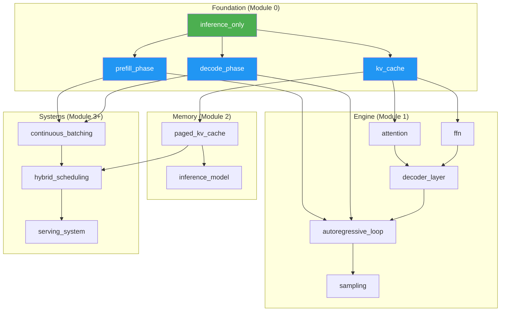

# nano‑vLLM Build‑from‑Scratch의 OKF 기반 Brick‑by‑Brick 학습 체계 재구성 가이드

> *"We build 'nano‑vLLM' through 14 structured labs, each focusing on one core concept with clear, modular visualizations. This guide adopts a brick‑by‑brick approach, showing exactly how each component fits into the growing system."*

---

## 1. 서론: 왜 OKF + Brick‑by‑Brick인가?

nano‑vLLM 학습 자료는 **14개 랩(Lab)** 으로 구성된 방대한 내용을 담고 있습니다. 이 자료를 효과적으로 학습하려면 **단순한 순차적 읽기가 아닌, 개념의 계층적 이해와 점진적 조립**이 필요합니다.

**OKF(Open Knowledge Format) + Brick‑by‑Brick 접근법**이 제공하는 이점:

| 기존 학습 방식 | OKF + Brick‑by‑Brick 방식 |
|---|---|
| 14개 랩을 선형적으로 읽음 | 원자적 개념 → 복합 개념 → 전체 시스템으로 **계층적 조립** |
| 개념 간 관계가 암묵적 | `PREREQUISITE_OF`, `COMPOSED_OF`, `BUILDS_UPON`으로 **명시적 관계화** |
| 학습 진척도 추적 어려움 | 각 개념의 `status`(draft/learned/mastered)로 **진척도 관리** |
| 복습 시 재탐색 필요 | 그래프 기반 **시각적 내비게이션**으로 원하는 개념 즉시 이동 |
| 에이전트 활용 제한 | OKF KB를 에이전트가 직접 읽고 **자가 진단 및 추론** |

---

## 2. nano‑vLLM 개념의 계층적 분해 (Brick Taxonomy)

### 2.1 원자적 개념 (Atomic Concepts) — 더 이상 분해할 수 없는 기본 단위

| ID | 개념 | 설명 | 선행 조건 |
|---|---|---|---|
| [`atomic.inference_only`](concepts/03_atomic/inference_only.md) | Inference‑Only Graph | 훈련 그래프와 달리 역전파, 옵티마이저, 그래디언트가 없는 순전파 전용 그래프 | 없음 |
| [`atomic.prefill_phase`](concepts/03_atomic/prefill_phase.md) | Prefill Phase | 전체 프롬프트를 한 번에 처리하는 Compute‑Bound 단계 | [`atomic.inference_only`](concepts/03_atomic/inference_only.md) |
| [`atomic.decode_phase`](concepts/03_atomic/decode_phase.md) | Decode Phase | 토큰을 하나씩 생성하는 Memory‑Bound 단계 | [`atomic.inference_only`](concepts/03_atomic/inference_only.md) |
| [`atomic.kv_cache`](concepts/03_atomic/kv_cache.md) | KV Cache | 각 토큰의 Key/Value를 저장하는 동적 상태 | [`atomic.inference_only`](concepts/03_atomic/inference_only.md) |
| [`atomic.attention`](concepts/03_atomic/attention.md) | Masked Self‑Attention | Query‑Key‑Value 연산 + Causal Masking | [`atomic.kv_cache`](concepts/03_atomic/kv_cache.md) |
| [`atomic.ffn`](concepts/03_atomic/ffn.md) | Feed‑Forward Network | 각 토큰에 독립적으로 적용되는 2층 MLP | [`atomic.attention`](concepts/03_atomic/attention.md) |
| [`atomic.sampling`](concepts/03_atomic/sampling.md) | Sampling Strategy | 로짓→토큰 ID 변환 (온도, top‑k, top‑p 등) | [`atomic.decode_phase`](concepts/03_atomic/decode_phase.md) |
| [`atomic.continuous_batching`](concepts/03_atomic/continuous_batching.md) | Continuous Batching | 여러 요청을 동시에 처리하는 일괄 처리 | [`atomic.prefill_phase`](concepts/03_atomic/prefill_phase.md), [`atomic.decode_phase`](concepts/03_atomic/decode_phase.md) |
| [`atomic.paged_kv_cache`](concepts/03_atomic/paged_kv_cache.md) | Paged KV Cache | 고정 크기 블록 단위의 KV 캐시 관리 | [`atomic.kv_cache`](concepts/03_atomic/kv_cache.md) |
| `atomic.hybrid_scheduling` | Hybrid Scheduling | 우선순위 기반 지능형 스케줄링 | [`atomic.continuous_batching`](concepts/03_atomic/continuous_batching.md) |

### 2.2 복합 개념 (Composite Concepts) — 원자적 개념들의 조합

| ID | 구성 요소 | 설명 |
|---|---|---|
| [`composite.inference_model`](concepts/02_composite/inference_model.md) | [`atomic.inference_only`](concepts/03_atomic/inference_only.md) + [`atomic.kv_cache`](concepts/03_atomic/kv_cache.md) | 추론 전용 모델의 전체 메모리 모델 (가중치 40%, KV Cache 55%, Activation 5%) |
| [`composite.autoregressive_loop`](concepts/02_composite/autoregressive_loop.md) | [`atomic.prefill_phase`](concepts/03_atomic/prefill_phase.md) + [`atomic.decode_phase`](concepts/03_atomic/decode_phase.md) + [`atomic.sampling`](concepts/03_atomic/sampling.md) | 프리필→디코드 반복의 자가회귀 생성 루프 |
| [`composite.decoder_layer`](concepts/02_composite/decoder_layer.md) | [`atomic.attention`](concepts/03_atomic/attention.md) + [`atomic.ffn`](concepts/03_atomic/ffn.md) + 잔차 연결 | 단일 Transformer 디코더 계층 전체 |
| [`composite.serving_system`](concepts/02_composite/serving_system.md) | [`atomic.continuous_batching`](concepts/03_atomic/continuous_batching.md) + [`atomic.paged_kv_cache`](concepts/03_atomic/paged_kv_cache.md) + `atomic.hybrid_scheduling` | vLLM의 전체 서빙 시스템 아키텍처 |

### 2.3 개념 간 관계 그래프

```
[atomic.inference_only]
    ├── PREREQUISITE_OF → [atomic.prefill_phase]
    ├── PREREQUISITE_OF → [atomic.decode_phase]
    └── PREREQUISITE_OF → [atomic.kv_cache]

[atomic.prefill_phase] ──┐
                          ├── COMPOSED_OF → [composite.autoregressive_loop]
[atomic.decode_phase] ───┤
                          │
[atomic.sampling] ────────┘

[atomic.kv_cache]
    ├── PREREQUISITE_OF → [atomic.paged_kv_cache]
    └── PREREQUISITE_OF → [atomic.attention]

[atomic.attention] ──┐
                      ├── COMPOSED_OF → [composite.decoder_layer]
[atomic.ffn] ────────┘

[atomic.continuous_batching] ──┐
                                ├── COMPOSED_OF → [composite.serving_system]
[atomic.paged_kv_cache] ────────┤
                                │
[atomic.hybrid_scheduling] ────┘
```

---

## 3. OKF KB 디렉토리 구조

```
.okf/
├── index.md                          # 전체 KB 인덱스 및 내비게이션
├── log.md                            # 변경 이력 (ISO 날짜, 최신순)
│
├── 00_meta/                          # 메타 정보
│   ├── learning_path.md              # 전체 학습 경로 (Module 0→14 순서)
│   └── glossary.md                   # 용어 사전
│
├── 01_atomic_concepts/               # 원자적 개념 (Atomic Concepts)
│   ├── inference_only.md             # atomic.inference_only
│   ├── prefill_phase.md              # atomic.prefill_phase
│   ├── decode_phase.md               # atomic.decode_phase
│   ├── kv_cache.md                   # atomic.kv_cache
│   ├── attention.md                  # atomic.attention
│   ├── ffn.md                        # atomic.ffn
│   ├── sampling.md                   # atomic.sampling
│   ├── continuous_batching.md        # atomic.continuous_batching
│   ├── paged_kv_cache.md             # atomic.paged_kv_cache
│   └── hybrid_scheduling.md          # atomic.hybrid_scheduling
│
├── 02_composite_concepts/            # 복합 개념 (Composite Concepts)
│   ├── inference_model.md            # composite.inference_model
│   ├── autoregressive_loop.md        # composite.autoregressive_loop
│   ├── decoder_layer.md              # composite.decoder_layer
│   └── serving_system.md             # composite.serving_system
│
├── 03_labs/                          # 원본 랩 구조와의 매핑
│   ├── module_00_foundational.md     # Module 0: Lab 0.1~0.2
│   ├── module_01_autoregressive.md   # Module 1: Lab 1.1~1.3
│   ├── module_02_kv_cache.md         # Module 2: Lab 2.1~2.x
│   ├── module_03_batching.md         # Module 3: Lab 3.1~3.x
│   └── ... (Module 4~13)
│
├── 04_diagrams/                      # 다이어그램 (OKF에서 참조)
│   ├── training_vs_inference.md      # 훈련 vs 추론 그래프 비교
│   ├── prefill_decode_timeline.md    # 프리필/디코드 타임라인
│   └── decoder_layer_flow.md         # 디코더 계층 데이터 흐름
│
└── 05_exercises/                     # 학습 확인용 실습 과제
    ├── checkpoint_01.md              # Module 0 완료 확인
    ├── checkpoint_02.md              # Module 1 완료 확인
    └── ...
```

---

## 4. OKF 파일 작성 템플릿

### 4.1 원자적 개념 템플릿 (`01_atomic_concepts/kv_cache.md`)

```markdown
---
type: AtomicConcept
id: atomic.kv_cache
title: KV Cache
description: 각 토큰의 Key와 Value 텐서를 저장하는 동적 캐시로, 디코드 단계에서 재계산 없이 이전 토큰의 정보를 재사용하게 함
status: draft
learning_path:
  order: 3
  estimated_time: 20min
generated:
  by: process:curator
  at: 2026-08-05T10:00:00Z
verified:
  - by: human:expert
    at: 2026-08-06T09:00:00Z
prerequisites:
  - atomic.inference_only
composes_into:
  - composite.inference_model
  - composite.autoregressive_loop
  - composite.decoder_layer
sources:
  - id: original_lab
    resource: https://hackmd.io/9Ivogn3dRwm3WgA4Kl3fJQ#Lab-0.1
    title: "nano-vLLM Lab 0.1: The Inference-Only Graph"
diagrams:
  - ref: 04_diagrams/memory_breakdown.md
    caption: "Inference Memory Usage After 100 Decode Steps"
---

# KV Cache (Key-Value Cache)

## 핵심 개념

LLM 추론에서 KV Cache는 **동적 상태의 핵심**이다. 

- **역할**: 각 디코드 단계에서 이전 토큰들의 K, V 텐서를 저장하여 재계산을 방지
- **특징**: 
  - 추가 전용(Append-Only) 성장
  - 읽기 집약적(Read-Intensive)
  - 메모리 대역폭이 병목

## 메모리 영향

| 단계 | KV Cache 비중 |
|---|---|
| Prefill 시작 시 | 5% |
| 100 Decode 단계 후 | 55% |

## 관련 개념

- **선행 조건**: [[atomic.inference_only]]
- **상위 개념**: [[composite.inference_model]], [[composite.autoregressive_loop]]
- **파생 개념**: [[atomic.paged_kv_cache]]

## 확인 문제

1. KV Cache가 없는 경우 디코드 단계에서 어떤 일이 발생하는가?
2. KV Cache의 메모리 사용량이 시간에 따라 어떻게 변화하는가?
```

### 4.2 복합 개념 템플릿 (`02_composite_concepts/autoregressive_loop.md`)

```markdown
---
type: CompositeConcept
id: composite.autoregressive_loop
title: Autoregressive Decoding Loop
description: Prefill 단계와 Decode 단계를 반복하며 토큰을 순차적으로 생성하는 전체 추론 루프
status: draft
components:
  - atomic.prefill_phase
  - atomic.decode_phase
  - atomic.sampling
prerequisites:
  - atomic.inference_only
  - atomic.kv_cache
generated:
  by: process:curator
  at: 2026-08-05T10:00:00Z
---

# Autoregressive Decoding Loop

## 전체 구조

```
[Prompt 입력]
     │
     ▼
┌─────────────────────────────────┐
│  Prefill Phase (1회)            │  ← Compute-Bound
│  - 전체 프롬프트 순전파         │
│  - KV Cache 초기 채움           │
└─────────────────────────────────┘
     │
     ▼
┌─────────────────────────────────┐
│  Decode Phase (반복)            │  ← Memory-Bound
│  - 새 토큰 1개 생성             │
│  - KV Cache에 추가              │
└─────────────────────────────────┘
     │
     ▼
  [종료 조건: EOS 또는 최대 길이]
```

## 구성 요소

| 단계 | 구성 개념 | 비고 |
|---|---|---|
| Prefill | [[atomic.prefill_phase]] | Compute-Bound, 1회 실행 |
| Decode | [[atomic.decode_phase]] | Memory-Bound, 반복 실행 |
| 토큰 선택 | [[atomic.sampling]] | 매 디코드 단계마다 실행 |

## 학습 경로

1. [[atomic.inference_only]] 이해
2. [[atomic.kv_cache]] 이해
3. [[atomic.prefill_phase]] + [[atomic.decode_phase]] 이해
4. 본 개념 (composite.autoregressive_loop) 학습
5. [[atomic.sampling]] 학습으로 확장
```

---

## 5. Brick‑by‑Brick 학습 경로 설계

### 5.1 전체 로드맵 (14개 랩 → 4개 단계)

| 단계 | 학습 목표 | 포함 개념 | 원본 Module |
|---|---|---|---|
| **Foundation** | 추론의 기본 모델 이해 | [`inference_only`](concepts/03_atomic/inference_only.md), [`prefill_phase`](concepts/03_atomic/prefill_phase.md), [`decode_phase`](concepts/03_atomic/decode_phase.md) | Module 0 |
| **Engine** | 자가회귀 생성 엔진 이해 | [`attention`](concepts/03_atomic/attention.md), [`ffn`](concepts/03_atomic/ffn.md), [`autoregressive_loop`](concepts/02_composite/autoregressive_loop.md), [`sampling`](concepts/03_atomic/sampling.md) | Module 1 |
| **Memory** | KV Cache와 메모리 관리 이해 | [`kv_cache`](concepts/03_atomic/kv_cache.md), [`paged_kv_cache`](concepts/03_atomic/paged_kv_cache.md), [`inference_model`](concepts/02_composite/inference_model.md) | Module 2 |
| **Systems** | 대규모 서빙 아키텍처 이해 | [`continuous_batching`](concepts/03_atomic/continuous_batching.md), `hybrid_scheduling`, [`serving_system`](concepts/02_composite/serving_system.md) | Module 3~13 |

### 5.2 학습 진척도 추적을 위한 OKF 메타데이터

각 개념 파일의 `status` 필드를 학습 단계에 따라 업데이트:

```yaml
status: draft      # 아직 학습하지 않음
status: learning   # 학습 중
status: learned    # 개념 이해 완료
status: mastered   # 심화 이해 및 응용 가능
```

### 5.3 에이전트 기반 학습 도우미

Builder 에이전트가 학습자의 진척도를 추적하고 다음 단계를 제안:

```python
# src/agents/learning_guide.py
@llm_behavior(pattern="""
    MATCH (c:Concept)
    WHERE c.status = 'learned'
      AND exists((c)-[:PREREQUISITE_OF]->(n:Concept))
      AND n.status = 'draft'
    RETURN c, n
""")
def suggest_next_concept(graph, learned_prereqs):
    """
    학습자가 'learned' 상태로 마킹한 개념을 기반으로,
    선행 조건이 모두 충족된 다음 개념을 추천.
    """
    for prereq, next_concept in learned_prereqs:
        # 모든 선행 조건이 충족되었는지 확인
        all_prereqs = graph.query("""
            MATCH (p:Concept)-[:PREREQUISITE_OF]->(n)
            WHERE n.id = $next_id
            RETURN p.status
        """, next_id=next_concept.id)
        
        if all(p.status == 'learned' for p in all_prereqs):
            yield {
                'concept': next_concept.id,
                'title': next_concept.title,
                'reason': f"All prerequisites for {next_concept.id} are satisfied"
            }
```

---

## 6. 시각화: OKF KB + ActiveGraph 기반 학습 대시보드

### 6.1 지식 그래프 시각화 (`dist/learning_dashboard.html`)

```html
<!-- ActiveGraph + Cytoscape.js 기반 실시간 학습 대시보드 -->
<!DOCTYPE html>
<html>
<head>
    <title>nano-vLLM Learning Dashboard</title>
    <script src="https://unpkg.com/cytoscape/dist/cytoscape.min.js"></script>
</head>
<body>
    <div id="cy" style="width:100%;height:800px;"></div>
    <script>
        // OKF KB에서 로드한 개념 그래프 렌더링
        // - 초록색: mastered, 파란색: learned, 회색: draft
        // - 실선: COMPOSED_OF, 점선: PREREQUISITE_OF
        // - 클릭 시 해당 개념의 OKF 파일로 이동
    </script>
</body>
</html>
```

### 6.2 학습 경로 시각화 (Mermaid)



---

## 7. 구현 로드맵

### Phase 1: OKF KB 초기화 (1일)
- [ ] `.okf/` 디렉토리 생성 및 `index.md`, `log.md` 작성
- [ ] nano‑vLLM의 14개 랩에서 원자적 개념 10개 추출 및 OKF 파일 작성
- [ ] 복합 개념 4개 작성 및 관계 정의 (`PREREQUISITE_OF`, `COMPOSED_OF`)

### Phase 2: 학습 경로 설계 (1일)
- [ ] `learning_path.md`에 전체 학습 순서 정의
- [ ] 각 개념에 `status`, `estimated_time`, `prerequisites` 필드 추가
- [ ] Module 0~13과 개념 간 매핑 테이블 작성

### Phase 3: 에이전트 연동 (2일)
- [ ] Brick 01 (Injest): OKF KB 변경 감지
- [ ] Brick 02 (Compile): 개념 간 관계 그래프 컴파일
- [ ] Brick 03 (Ask): 학습자 질문에 컨텍스트 제공
- [ ] Learning Guide Agent: 다음 학습 개념 추천

### Phase 4: 시각화 및 검증 (1일)
- [ ] `okf_visualize.py`로 지식 그래프 HTML 생성
- [ ] `okf_validator.py`로 OKF v0.2 규격 검증
- [ ] CI 연동 (GitHub Actions)

---

## 8. OKF v0.2 준수 체크리스트

- [ ] 모든 `.md` 파일에 YAML frontmatter 존재
- [ ] 모든 파일에 `type` 필드 (AtomicConcept / CompositeConcept / ...)
- [ ] `index.md`에 `okf_version: v0.2` 명시
- [ ] `log.md`에 ISO 날짜 기반 변경 이력
- [ ] `sources` 필드로 원본 자료 연결 (HackMD URL)
- [ ] `generated` 필드로 생성 주체 및 시간 기록
- [ ] `prerequisites` 및 `composes_into`로 관계 명시
- [ ] `status` 필드로 학습 진척도 관리

---

## 9. 기대 효과

1. **개념의 계층적 이해**: 원자적 개념부터 시작하여 점진적으로 복합 개념으로 확장
2. **학습 경로의 명시화**: 어떤 개념을 먼저 배워야 하는지 그래프로 시각화
3. **자가 진단 가능**: 학습자가 자신의 진척도를 OKF 상태 필드로 추적
4. **에이전트 지원**: Builder 에이전트가 다음 학습 단계를 자동 추천
5. **재사용성**: OKF KB는 다른 LLM 시스템 학습에도 확장 가능

> *"This guide adopts a brick‑by‑brick approach, showing exactly how each component fits into the growing system."*

OKF + Brick‑by‑Brick은 이 원칙을 **실행 가능한 지식 구조**로 구현합니다. nano‑vLLM의 14개 랩이 단순한 문서 묶음이 아닌, **에이전트가 읽고 추론하며 학습자를 안내하는 살아있는 지식 그래프**로 재탄생합니다.