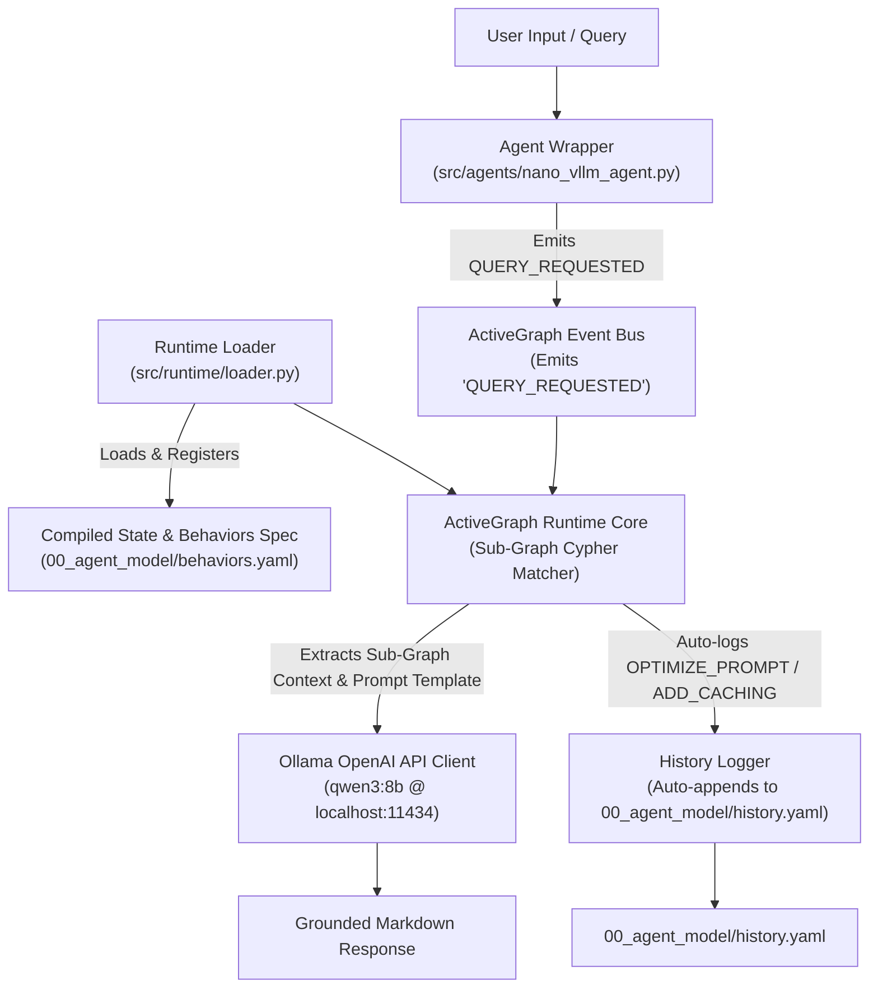

  ──────
  ## 🛠️ 수행된 작업 요약

  ### 1. OKF 코어 엔진 개발 (src/okf/)
  • **validator.py**
      • .okf/ 번들 전체(00_agent_model, 01_nano_vllm, 02_store_front)의 YAML Frontmatter, ID 충돌, 링크 정밀도,
      무결성 및 순환 의존성을 검증합니다.
      • 최신 디렉터리 구조(concepts/01_module, 02_composite, 03_atomic)를 지원하도록 범용화되었습니다.
  • **ir.py**
      • 파싱된 지식 노드와 관계망을 메모리 내 중간 표현(Intermediate Representation) Graph로 관리합니다.
  • **history.py**
      • 00_agent_model/history.yaml에 기록된 그래프 연산자 (SPLIT, MERGE, REORDER, RENAME, UPDATE_STATUS 등)를 IR에
      순차 적용합니다.
  • **compiler.py**
      • 1단계: 내장된 OKFValidator를 실행하여 컴파일 직전 지식 베이스의 무결성을 재검증합니다.
      • 2단계: 지식 노드로부터 IR을 생성합니다.
      • 3단계: history.yaml 연산자를 적용하여 지식 그래프를 변환용 니다.
      • 4단계: ActiveGraph 런타임 제어용 최종 상태 파일인 **behaviors.yaml**을 자동 생성합니다.

  ──────
  ### 2. 00_agent_model 스키마 및 히스토리 로그 구축

  • **history.yaml**
      • 메모리 관리, 프리픽스 캐싱, 분산 서빙 모듈의 분해 연산(SPLIT) 및 상태 기록을 담은 전용 히스토리 연산 로그
      스키마를 정의했습니다.
  • **behaviors.yaml**
      • 컴파일러 실행을 통해 83개 노드, 23개 ActiveGraph Cypher @llm_behavior 패턴 매처 및 상태 모델이 수집된 최종
      Executable Control Graph 명세를 출력했습니다.

  ──────
  ### 3. 기존 분석 도구 범용화 및 KB 무결성 수정

  • **okf_link_check.py**: src.okf.validator 코어 엔진을 호출하도록 범용화했습니다.
  • **okf_visualizer.py**: 최신 01_module, 02_composite, 03_atomic 경로 분류 지원 및 dist/index.html 시각화 대시보드
  생성을 검증했습니다.
  • KB 무결성 개선: 01_nano_vllm 내 개념 파일들의 YAML 프론트머터 구문 오류 수정 및 composite.paged_attention_manager
  추가로 오류 0개(PASS) 상태를 달성했습니다.
  ──────
  ## 🚦 검증 및 컴파일 테스트 결과

    # 1. KB 링크 및 무결성 검증 (오류 0개 PASS)
    python src/tools/okf_link_check.py D:/code/brick-graph-agent/.okf

    # 2. OKF 동적 그래프 컴파일러 실행 (behaviors.yaml 생성)
    python -m src.okf.compiler D:/code/brick-graph-agent/.okf

    # 3. 지식 그래프 HTML 대시보드 빌드
    python src/tools/okf_visualizer.py D:/code/brick-graph-agent/.okf
    
 ## Outlining the Agent's Plan

  I'm now formulating the architecture for the query-response agent. I'm focusing on a structured plan for the nano-
  vLLM bundle, aiming to meet the "show me the plan first" request. The core capabilities involve knowledge retrieval
  from OKF files and local LLM integration using Ollama. My current outline includes handling the user's queries against
  the OKF graph and leveraging the local Ollama API. I'm prioritizing concise, markdown-formatted responses.

# 🚀 Updated Plan: ActiveGraph-based nano-vLLM Query Agent (Ollama qwen3:8b)

> **Goal**: Build an **ActiveGraph Runtime-Driven Agent** for the `nano-vllm` OKF Knowledge Base, using **Ollama (`qwen3:8b`)**, event-driven state transitions (`QUERY_REQUESTED`), compiled prompt templates in `behaviors.yaml`, and automatic runtime logging to `history.yaml`.

---

## 🎯 Revised Architecture Blueprint

---

## 📋 Detailed Component & Specification Upgrades

### 1. `src/runtime/loader.py` (Replaces `retriever.py`)
- Ingests `00_agent_model/behaviors.yaml` and registers Cypher patterns, handlers, and prompt templates into the ActiveGraph Runtime instance.
- Manages sub-graph node indexing for high-speed, localized context assembly.

### 2. `src/agents/nano_vllm_agent.py` (ActiveGraph Runtime Wrapper)
- Serves as the user-facing entry point and interactive CLI REPL.
- Wraps the ActiveGraph Runtime instance. When a question is asked:
  1. Emits `QUERY_REQUESTED` event with query payload.
  2. Runtime evaluates active Cypher behaviors.
  3. Matched behavior triggers local sub-graph prompt execution via Ollama `qwen3:8b`.

### 3. Compiler Upgrade (`src/okf/compiler.py` & `behaviors.yaml`)
- Enhance `compiler.py` to generate explicit `prompt_template` fields for each behavior.
- Define targeted Cypher patterns that extract **focused sub-graphs** (target concept + immediate `prerequisites` & `composed_of` nodes) to stay strictly within `qwen3:8b`'s context limits (8K~32K).

### 4. `src/runtime/history_logger.py` (Runtime Auto-Logging)
- When the runtime executes behavior optimization, prompt refinement (`OPTIMIZE_PROMPT`), or caching (`ADD_CACHING`), it automatically appends structured operation entries to `00_agent_model/history.yaml`.

---

## 🛠️ Step-by-Step Implementation Roadmap

1. **Step 1: Compiler & Schema Update (`src/okf/compiler.py`)**
   - Update compiler to inject `prompt_template` and focused sub-graph Cypher pattern queries into `00_agent_model/behaviors.yaml`.
2. **Step 2: Build `RuntimeLoader` (`src/runtime/loader.py`)**
   - Implement `loader.py` to load `behaviors.yaml` and initialize the ActiveGraph Runtime state.
3. **Step 3: Build Ollama Client Wrapper (`src/runtime/ollama_client.py`)**
   - Implement client for `http://localhost:11434/v1` targeting `qwen3:8b`.
4. **Step 4: Build ActiveGraph Agent & Runtime Wrapper (`src/agents/nano_vllm_agent.py`)**
   - Build runtime wrapper, event bus listener (`QUERY_REQUESTED`), and response handler.
5. **Step 5: History Auto-Logger (`src/runtime/history_logger.py`)**
   - Implement automatic logging of `OPTIMIZE_PROMPT` / `ADD_CACHING` ops to `00_agent_model/history.yaml`.
